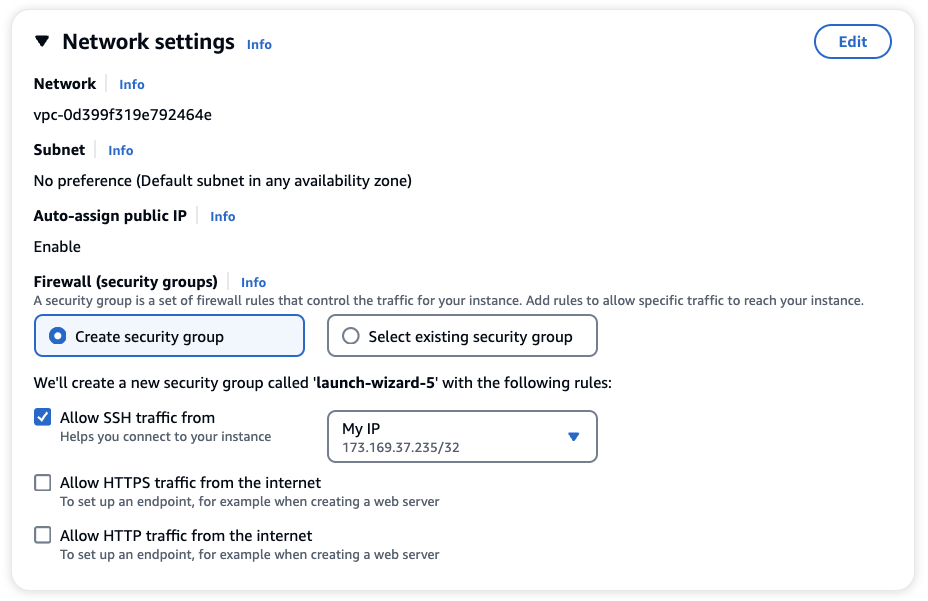
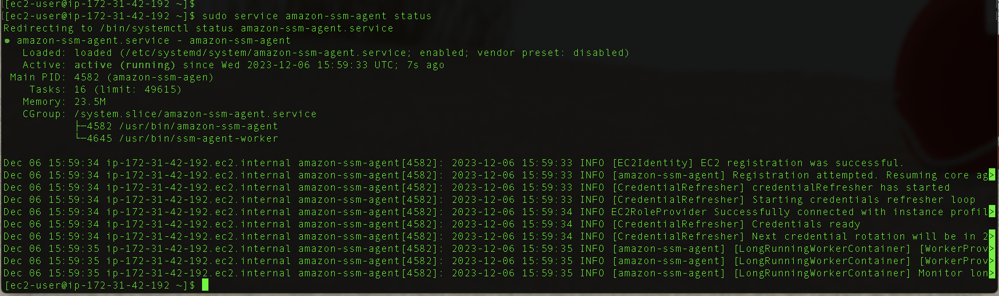
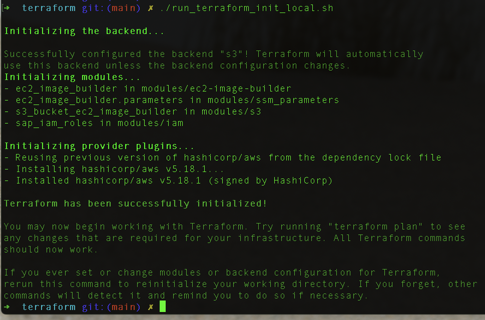

# The solution

This Terraform + Ansible code helps you to create the Golden AMIs for using with your SAP projects. This project creates two Golden AMIs: RedHat Enterprise Linux (RHEL) and Oracle Enterprise Linux (OEL).


# What is configured on the golden AMI

1. Install several packages using YUM: [link](/ansible/golden_amis/roles/role-install-libs-pkgs-agents/defaults/main.yaml)
2. Install AWS CLI: [link](/ansible/golden_amis/roles/role-install-libs-pkgs-agents/tasks/common/check_aws_cli.yaml)
3. Install AWS SAP Data Provider: [link](/ansible/golden_amis/roles/role-install-libs-pkgs-agents/tasks/rhel/install_data_provider_rhel.yaml)
4. Install EFS Utils: [link](/ansible/golden_amis/roles/role-install-libs-pkgs-agents/tasks/rhel/install_efs_utils.yaml)
5. Disable Firewall: [link](/ansible/golden_amis/roles/role-os-params/tasks/common/disable_firewall.yaml)
6. Set Clock Source: [link](/ansible/golden_amis/roles/role-os-params/tasks/common/set_clocksource.yaml)
7. Set Timezone: [link](/ansible/golden_amis/roles/role-os-params/tasks/common/set_timezone.yaml)
8. Set UUIDD: [link](/ansible/golden_amis/roles/role-os-params/tasks/common/set_uuidd.yaml)
9. Disable core dump, KSM, and SELINUX, enable TSX, Configure user limits for SAP, set general limits, set SAP conf and for tmp files, set tuned: [link](/ansible/golden_amis/roles/role-os-params/tasks/rhel/apply_rhel_specific_changes.yaml) and [link](/ansible/golden_amis/roles/role-os-params/tasks/oel/apply_oel_specific_changes.yaml) 

# How to update the Ansible code

1. Make a copy/fork of this repository into your own one
2. Make the required changes in the folder ```ansible```
3. Push your code to your own repository
4. Take a look at the file ```terraform/modules/ec2-image-builder/files/call_ansible_from_git.yaml```
- 4.1. On line 24 you'll see it cloning this original repo from main branch. Update it to clone your own repository
5. Run the Terraform solution
5.1 If this is not the first version you are running Terraform, add a new entry on the dev.tfvars file under "versions" variable. This way you will create a new build and not discard the previous AMI(s) created

# Running the solution

### 1 - Manual tasks for creating the base AMI for RHEL/SUSE/etc (any AMI from AWS Marketplace):

- 1.1. Subscribe to the RHEL AMI:
  - 1.1.1. Open "AWS Marketplace Solutions" on your AWS console.
  - 1.1.2. Navigate to "Discover Products" and search for "RHEL SAP"
  - 1.1.3. Subscribe to the image named "Red Hat Enterprise Linux for SAP with HA and Update Services 8.2" <br> 

- 1.2. Launch an instance using your just subscribed image:
  - 1.2.1. Go to AWS Marketplace again and then "Manage subscriptions" on the left menu
  - 1.2.2. Select the RHEL image you just subscribed
  - 1.2.3. Select "continue to launch through EC2" <br> 
  - 1.2.4. The parameters you have to fill in are (all the rest you can leave as default):

| Field | Suggested value | Comment |
| -- | -- | -- |
| Name | rhel-base |  |
| Key pair name | any | Select one keypair you have access to (or create a new key pair and save it somewhere safe. You're going to need it to SSH into the instance) |
| Allow SSH traffic from | My IP | Under network settings, select to create a new security group and allow SSH (port 22) via your IP only <br>  |
| IAM instance profile | ssm-role | Under "Advanced details", click "Create new IAM profile" and follow the steps: <br>1. Click "Create Role". <br>2. Select "AWS Service". <br>3. Scroll down and select "EC2 Role for AWS Systems Manager". <br>4. Select next. <br>5. Select next. <br>6. Add "ssm-role" on the role name. <br>7. Select "Create role". Go back to the previous tab, hit refresh on the IAM instance profile and select your newly created "ssm-role".

  - 1.2.5. Click "Launch instance"

- 1.3. Configure your new instance:
  - 1.3.1. Now back to the EC2 console, select your new instance and click "Connect".
  - 1.3.2. Switch to "SSH client" tab and copy the example string at the botton. It will be something like this: ```ssh -i "ec2.pem" ec2-user@ec2-54-166-251-188.compute-1.amazonaws.com```. Fix the path for your keypair (created on item 2.4 line one), paste it in a terminal and hit enter.
  - 1.3.3. Once you're inside your new instance, run the following command: ```sudo dnf install -y https://s3.amazonaws.com/ec2-downloads-windows/SSMAgent/latest/linux_amd64/amazon-ssm-agent.rpm``` (more details available here: https://docs.aws.amazon.com/systems-manager/latest/userguide/agent-install-rhel-8-9.html)
  - 1.3.4. Run ```sudo service amazon-ssm-agent status``` to make sure your service is "active" and there are no error logs in the agent. <br> 
  - 1.3.5. Make sure the overall step 3 is complete by going back into the EC2 console, select your instance, and click Connect. If the tab "Session Manager" doesn't have any error and allows you to click "Connect", leading to a new tab with an SSH session into your instance, it means the SSM agent is correctly installed and you are ready for the automated steps.

#### IMPORTANT! Make sure to check your SSM installation using step 3.5. If the SSM Agent installation is not correctly done, the automated steps with EC2 Image Builder will not work!

- 1.4. Create your BASE AMI for EC2 Image Builder to use:
  - 1.4.1 - Now back on the EC2 console, select your instance, click "Actions", then "Image and templates", then "Create image".
  - 1.4.2 - Give it the name "rhel-base" and click "Create image".
  - 1.4.3 - Go to "AMIs" on the menu on the left, find your new AMI and wait for it to be on Status "Available".
  - 1.4.4 - Copy the AMI ID and save it somewhere safe

- 1.5. Clean up the resources:
  - 1.5.1 - Delete the rhel-base instance used for capturing the AMI
  - 1.5.2 - Delete the security group created for SSHing into the instance (named launch-wizard-X)

### 2 - Manual tasks for creating the base AMI for OEL (Oracle Enterprise Linux)

- 2.1. Find your base AMI in this blog post from Oracle: https://forums.oracle.com/ords/apexds/post/launch-an-oracle-linux-instance-in-aws-9462
- 2.2. Once you find your AMI, on the list click "Launch instance from AMI" <br> 
- 2.3. Use the same instructions on step 1.2.4 above up until the end
- 2.4. After you are done creating your new AMI with the SSM Agent installed in it, for creating the new Parameter in Parameter Store (step 1.4.6 above), use the name ```/dev/ec2/amis/oel/base```

### 3 - Running the automation to create the golden AMIs

- 3.1. Create an S3 bucket to save your Terraform states and save its name. How to create the bucket here: https://docs.aws.amazon.com/AmazonS3/latest/userguide/create-bucket-overview.html
- 3.2. Update the file ```run_terraform_init.sh``` in this repo changing the value for the variable "BUCKET_NAME" with your new bucket
- 3.3. IMPORTANT: for productive environments, the run_terraform_init.sh should be updated to include a Dynamo DB table too. This prevents errors in the Terraform State file caused by multiple people trying to update it at the same time. More here: https://developer.hashicorp.com/terraform/language/settings/backends/s3
- 3.4 - In a console, cd into the terraform folder and run ```./run_terraform_init.sh``` <br> 
- 3.5 - Rename the file dev.tfvars.template into dev.tfvars and replace the following values:

| Variable | Comment | Sample value |
| -- | -- | -- |
| kms_key_arn | The KMS ARN you want to use. More on how to create keys: https://docs.aws.amazon.com/kms/latest/developerguide/create-keys.html | KMS ARN |
| vpc_id | The VPC ID to deploy this solution into | vpc-136fg512a80503b82 | 
| subnet_id | The Subnet ID to deploy this solution into | subnet-9efcd1og8f764b86f | 
| base_ami (RHEL) | First base_ami is for RHEL | ami-01453fg90e53509e3 | 
| base_ami (OEL) | Second base_ami is for OEL | ami-01453fg90e53509e3 | 

- 3.6 - Run ```./run_terraform_plan.sh``` and check the resources you are about to create
- 3.7 - Run ```./run_terraform_apply.sh```
- 3.8 - Results:
  - 3.8.1 - Once Terraform is done, your Golden AMI IDs will be available at EC2 > AMIs with a name prefixed with "Golden-AMI". <br> 
  - 3.8.2 - Also, you can find them on the SSM Parameter Store under the names ```/dev/amis/golden/oel/sap-and-oracle``` and ```/dev/amis/golden/rhel/sap```  <br> 